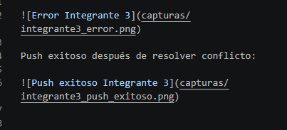

## Integrantes y roles

Complete esta tabla al final del taller.

| Rol | Nombre | Usuario de GitHub | Commit principal |
| --- | --- | --- | --- |
| Líder | Luis Vargas | LEVS3107 | f62eb436ff43052a5aa4a3765f5801c1d23a77b7 |
| Integrante 1 | Luis Mendoza | luis86129 | 658bfec16f5f3a048bd2c4a183405353e44906d7 |
| Integrante 2 | Kevin Borbor | kevllx | 74512cf25d641945e62350e92b04b37aae33fcea |
| Integrante 3 | Ricardo Gordillo | RicardoGordillo | 25eb788146214863e141a3598d62a6c35445b50b |
| Integrante 4 |  |  |  |

## Evidencias

Coloque las capturas dentro de una carpeta llamada `capturas/` y enláselas en esta sección.

Ejemplo:

### Líder

Push exitoso:

### Integrante 1

Error antes de resolver conflicto:

Push exitoso después de resolver conflicto:

### Integrante 2

Error antes de resolver conflicto:

Push exitoso después de resolver conflicto:

### Integrante 3

Error antes de resolver conflicto:

Push exitoso después de resolver conflicto:

### Líder

Modifico:

- En `GUIView.java`, cambiar el texto del botón de `Start Game` a `Jugar`.
- En `SnakeModel.java`, cambiar `Color.GRAY` por `Color.BLUE` en `SNAKE_HEAD_TILE`.
- En `SnakeModel.java`, cambiar `Color.RED` por `Color.GREEN` en `FRUIT_TILE`.
- En `GoldModel.java`, cambiar `Color.BLACK` por `Color.LIGHT_GRAY` en `COLLECTOR_TILE`.

Commit:

Líder: personalizar botón y colores principales

### Integrante 1

Modifico:

- En `GUIView.java`, cambiar el texto del botón de `Start Game` a `Let's Go!!!`.
- En `SnakeModel.java`, cambiar `Color.GRAY` por `Color.LIGHT_GRAY` en `SNAKE_HEAD_TILE`.

Commit:

Integrante 1: cambiar botón y cabeza de snake

### Integrante 2

Modifico:

- En `GUIView.java`, cambiar el texto del botón de `Start Game` a `Let's Play`.
- En `GoldModel.java`, cambiar `Color.BLACK` por `Color.BLUE` en `COLLECTOR_TILE`.

Commit:

Integrante 2: cambiar botón y colector de gold

### Integrante 3 <small>_(si hubiere)_</small>

Si el grupo tiene un tercer integrante adicional, modificar:

- En `GUIView.java`, cambiar el texto del botón de `Start Game` a `Iniciar`.
- En `GoldModel.java`, cambiar `Color.BLACK` por `Color.RED` en `COLLECTOR_TILE`.

Commit:

Integrante 3: cambiar botón y colector

